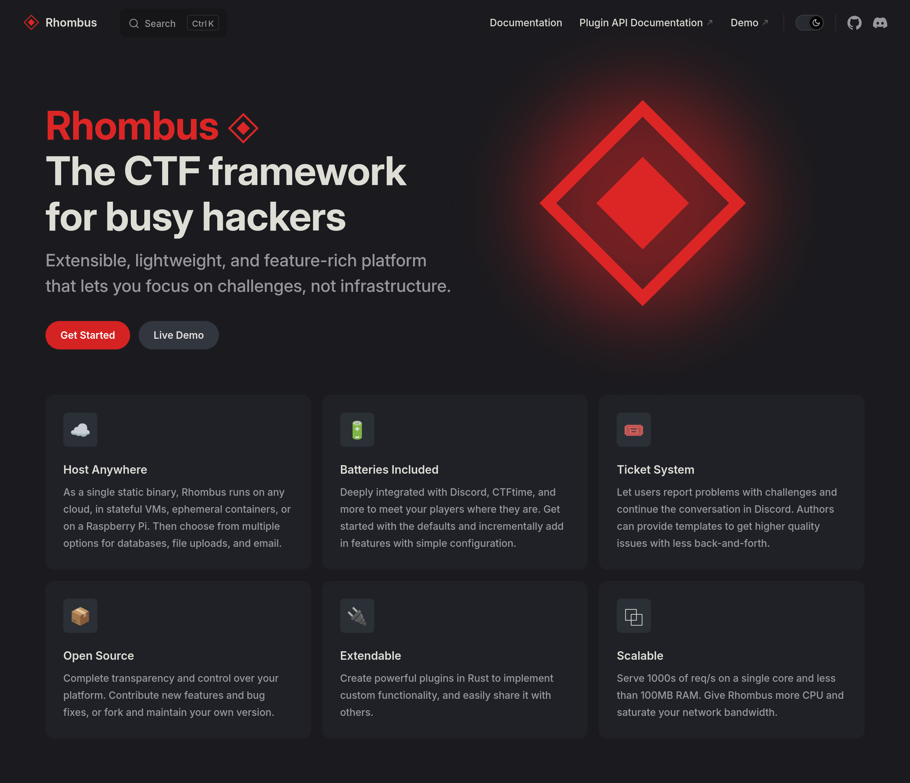
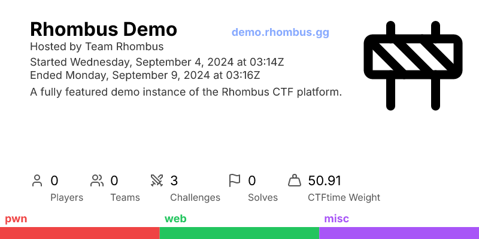

# Rhombus

Next generation extendable CTF framework with batteries included.

[![Crates.io][crates-badge]][crates-url]
[![Documentation][docs-badge]][docs-url]
[![License][license-badge]][license-url]
[![Build Status][actions-badge]][actions-url]

[crates-badge]: https://img.shields.io/crates/v/rhombus.svg
[crates-url]: https://crates.io/crates/rhombus
[docs-badge]: https://docs.rs/rhombus/badge.svg
[docs-url]: https://docs.rs/rhombus
[license-badge]: https://img.shields.io/badge/license-MPL--2.0-blue.svg
[license-url]: https://github.com/rhombusgg/rhombus/blob/main/LICENSE
[actions-badge]: https://github.com/rhombusgg/rhombus/actions/workflows/rust.yaml/badge.svg
[actions-url]: https://github.com/rhombusgg/rhombus/actions/workflows/rust.yaml

See [documentation for deployment](https://rhombus.gg), and a [hosted demo](https://demo.rhombus.gg).

[](https://rhombus.gg)
[](https://demo.rhombus.gg)

## Development

The MSRV is currently `1.80.0`.

### Nix (recommended)

A [Nix Flake](https://nixos.org) is provided for development. It is recommended to be paired with [direnv](https://direnv.net) for automatic environment setup.

### Individual dependencies

Required:

- [Rust](https://rust-lang.org/learn/get-started)
- [Deno](https://deno.com)

Optional (recommended):

- [mold](https://github.com/rui314/mold)
- [cargo-watch](https://github.com/watchexec/cargo-watch)
- [Task](https://taskfile.dev)

### Getting started

Run `task dev` to start the `standalone` example. This will build the project and start the server with live reloading.

### Project structure

```
├── rhombus/             # core library
│   ├── src/             # rust source code
│   ├── templates/       # minijinja templates
│   ├── static/          # static files like css, js
│   ├── frontend/        # TypeScript source code
│   ├── migrations/      # SQL database migrations
│   ├── locales/         # translations for the UI
├── rhombus-cli/         # CLI tool to manage and play CTFs
├── rhombus-build/       # core library for build scripts
├── docs/                # hosted docs on https://rhombus.gg
└── examples/
    ├── standalone/      # minimal example
    ├── demo/            # demo running https://demo.rhombus.gg
    ├── plugin/          # example plugin library
    └── external-plugin/ # uses `plugin` as a dependency
```
